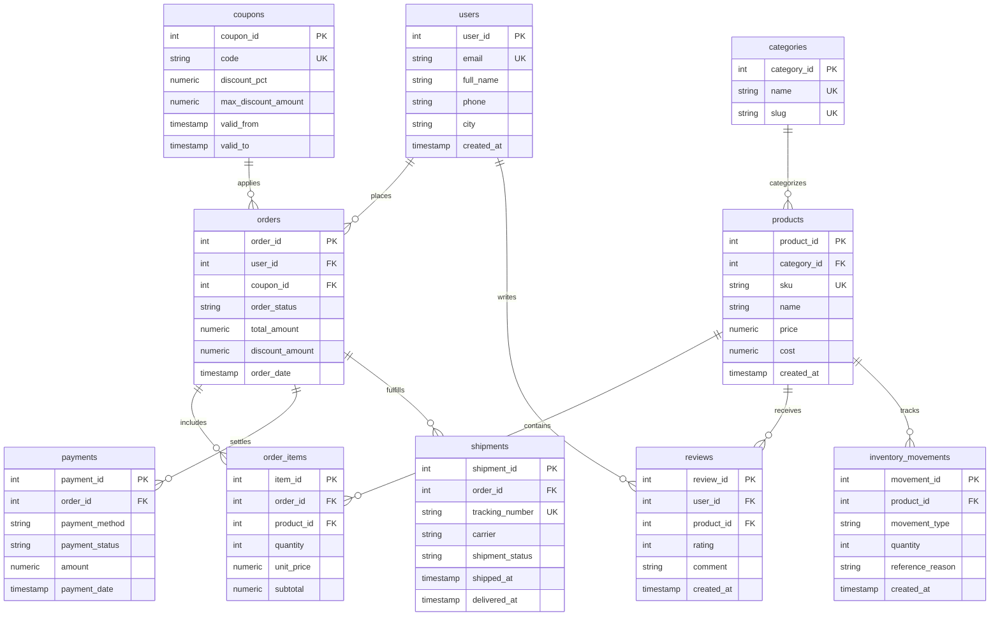

# E-Commerce OLTP Entity-Relationship Diagram

```mermaid
erDiagram
    users ||--o{ orders : places
    users ||--o{ reviews : writes
    categories ||--o{ products : categorizes
    products ||--o{ order_items : contains
    products ||--o{ reviews : receives
    products ||--o{ inventory_movements : tracks
    orders ||--o{ order_items : includes
    orders ||--o{ payments : settles
    orders ||--o{ shipments : fulfills
    coupons ||--o{ orders : applies

    users {
        int user_id PK
        string email UK
        string full_name
        string phone
        string city
        timestamp created_at
    }

    categories {
        int category_id PK
        string name UK
        string slug UK
    }

    products {
        int product_id PK
        int category_id FK
        string sku UK
        string name
        numeric price
        numeric cost
        timestamp created_at
    }

    coupons {
        int coupon_id PK
        string code UK
        numeric discount_pct
        numeric max_discount_amount
        timestamp valid_from
        timestamp valid_to
    }

    orders {
        int order_id PK
        int user_id FK
        int coupon_id FK
        string order_status
        numeric total_amount
        numeric discount_amount
        timestamp order_date
    }

    order_items {
        int item_id PK
        int order_id FK
        int product_id FK
        int quantity
        numeric unit_price
        numeric subtotal
    }

    payments {
        int payment_id PK
        int order_id FK
        string payment_method
        string payment_status
        numeric amount
        timestamp payment_date
    }

    shipments {
        int shipment_id PK
        int order_id FK
        string tracking_number UK
        string carrier
        string shipment_status
        timestamp shipped_at
        timestamp delivered_at
    }

    reviews {
        int review_id PK
        int user_id FK
        int product_id FK
        int rating
        string comment
        timestamp created_at
    }

    inventory_movements {
        int movement_id PK
        int product_id FK
        string movement_type
        int quantity
        string reference_reason
        timestamp created_at
    }
```